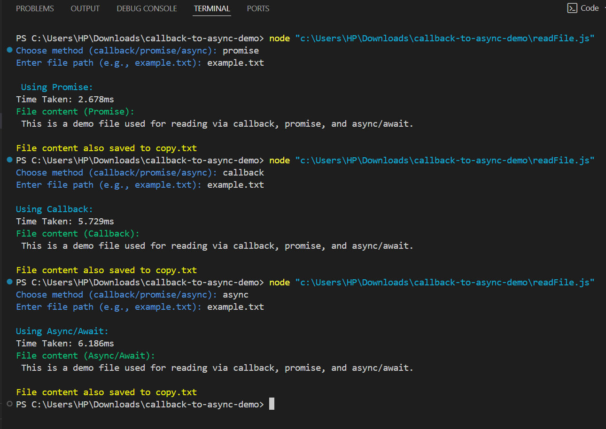

# Callback to Async/Await Demo

This project demonstrates how to convert Node.js asynchronous code from **callbacks** to **Promises** and **Async/Await**, with user interaction and enhanced terminal experience.

## 🚀 Features

- User input for method and file path
- Demonstrates all 3 async patterns
- Writes file output to `copy.txt`
- Terminal colored output using `chalk`
- Benchmarking using `console.time`
- Well-commented and beginner-friendly

## 🧪 Usage

1. Install dependencies:
   ```bash
   npm install chalk
   ```

2. Run:
   ```bash
   node readFileInteractive.js
   ```

3. Choose one:
   - `callback`
   - `promise`
   - `async`

## 📁 Files

- `readFileInteractive.js` — Main interactive script
- `example.txt` — Sample input file
- `copy.txt` — Output file created after reading
- `test.js` — Sample test

## 💡 Summary

- **Callback** — Traditional but messy.
- **Promise** — Better for chaining.
- **Async/Await** — Cleanest and modern approach.

## 📸 Output Screenshot

Here is a sample terminal output:



